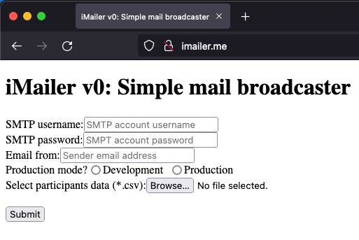

# iMailer
A PHP-based email broadcast script.

## Motivation
This project was started in order to efficiently distribute information to all participants of Indonesia Bebras Challenge who registered through University of Surabaya (UBAYA) bureau.

## Built With
* PHP
* Swift Mailer

## Getting Started
In order to get a local copy up and running in your machine, follow these simple steps.
### Prerequisites
* PHP version 7 or above
* Apache server installed in your machine
* Composer
* Swift Mailer

### Components
* index.php :arrow_right: The main file to start broadcasting the email to all preloaded participants data.
* data_reader.php :arrow_right: It contains scripts to parse the participants data which is stored in a **csv** file and to pre-load the email's template.
* mail_template.html :arrow_right: The template of email to be broadcasted.

### Usage
1. Start the Apache web server in your local machine
```
$ sudo apachectl start
```
2. Open your favorite text editor, e.g. Visual Studio Code, and load the project repository.
3. **Important!!!** Put the **csv** file that contains **participant data** inside the `src` folder.
4. Open your favorite web browser and go to the local repository on your machine by typing `localhost/local_project_repository` in your browser's address bar.
   In case you want to setup a virtual host for your local machine, then you might need to modify the `hosts` file of your Operating System and the corresponding Apache's virtual host configuration file.
5. In the homepage of this project you will see the following page 
6. Fill in your mail SMTP server's username and password in their corresponding input fields.
7. Fill in the designated sender mail address. This mail address will be displayed in your recipient's mail. If you leave this sender mail address blank, then by default the same address that you use for your SMTP server's username will be used.
8. Select the current execution mode. Select `Development` for testing the layout of your broadcasted email. In contrast, select `Production` if you really want to broadcast the email.
9. Select the CSV file for your participants list. (This is the CSV file that you have copied into your `src` folder previously)
10. Press the `Submit` button, and wait for the result.

## License
Distributed under the MIT license. See `LICENSE` file for more information.

## Contact
A.Yohan